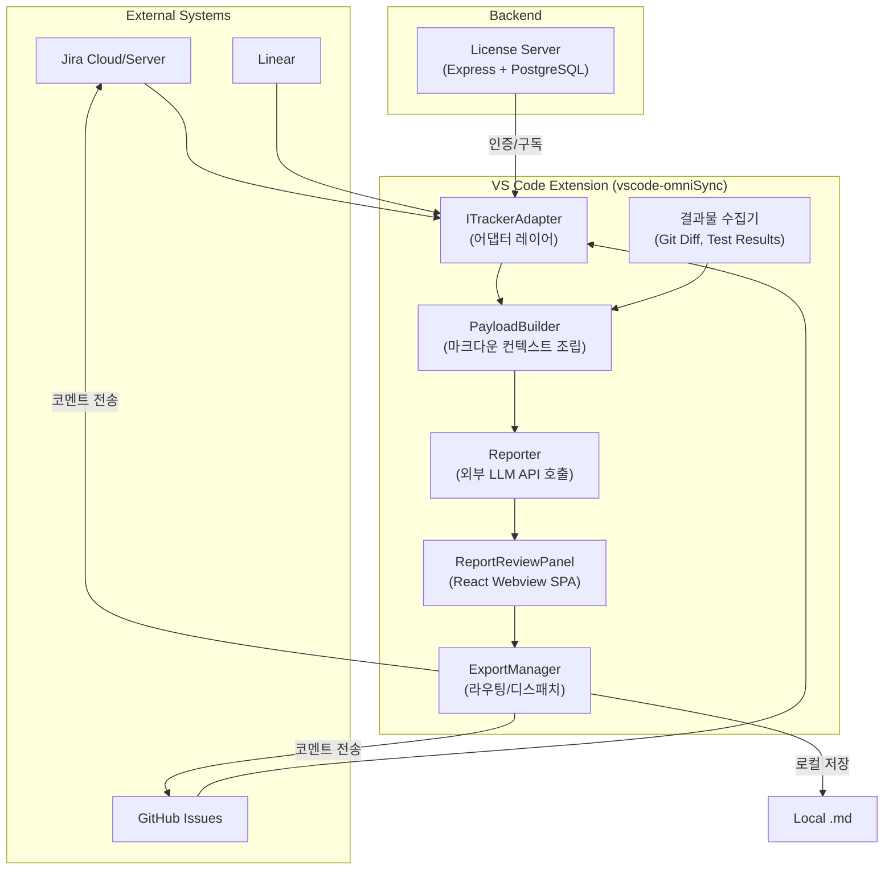

# 🌐 OmniSync — VS Code Extension

[](https://github.com/kin123s/vscode-omniSync)
[](LICENSE)
[](https://code.visualstudio.com/)
[](https://www.typescriptlang.org/)
[](https://pnpm.io/)

> **멀티 플랫폼 대응 AI 프로젝트 어시스턴트(Universal Agent)로 동작하는 VS Code 전용 확장(Extension)입니다.**
>
> IDE(VS Code)를 떠나지 않고도, Jira · GitHub Issues · Linear 등 주요 이슈 트래킹 플랫폼을 하나의 통합 뷰로 연동하고, AI를 통해 업무 맥락(Context)을 지능적으로 관리합니다.

---

## 📖 목차

- [개발 배경](#-개발-배경)
- [핵심 기능](#-핵심-기능)
- [시스템 아키텍처](#-시스템-아키텍처)
- [기술 스택](#-기술-스택)
- [프로젝트 구조](#-프로젝트-구조)
- [시작하기](#-시작하기)
- [설정 옵션](#-설정-옵션)
- [진행 상황 (Roadmap)](#-진행-상황-roadmap)
- [기여하기](#-기여하기)
- [라이선스](#-라이선스)

---

## 💡 개발 배경

현재 개발 환경에는 다양한 이슈 트래커(Jira, GitHub Issues, Linear 등)와 AI 에이전트(Copilot, Cursor, Antigravity 등)가 존재하지만, 개발자는 여전히 **플랫폼 간 컨텍스트 스위칭 비용**을 지불해야 하며 파편화된 정보를 직접 모아야만 온전한 프로젝트 관리가 가능합니다.

**OmniSync**는 이 문제를 해결하기 위해 탄생했습니다:

- 🔀 **컨텍스트 스위칭 제거** — IDE 안에서 모든 이슈 트래커를 통합 관리
- 🤖 **AI 기반 자동 리포팅** — 코드 변경사항을 분석하여 진행 상황을 자동 생성
- 🔐 **Zero-Trust 보안 설계** — 사내망(on-premise)과 클라우드 환경 모두 안전하게 지원

> 본 프로젝트는 `prj-vscode-extension` 모노레포의 **퍼블릭 서브모듈**로 관리됩니다.

---

## ✨ 핵심 기능

| 기능 | 설명 | 상태 |
|------|------|:----:|
| **다중 트래커 연동** | Jira Cloud/Server, GitHub Issues, Linear 등을 통합 TreeView로 탐색 | ✅ 구현됨 |
| **OAuth 2.0 / API Token 인증** | Jira Cloud OAuth, Server PAT, GitHub PAT, Linear API Key 지원 | ✅ 구현됨 |
| **이슈 탐색기 (TreeView)** | Activity Bar에서 이슈를 계층적으로 탐색 · 검색 · 브라우저 열기 | ✅ 구현됨 |
| **작업 시간 추적 (Time Tracker)** | 이슈 단위 작업 시간 자동 추적 및 Git Diff 수집 | ✅ 구현됨 |
| **AI 채팅 참여자** | VS Code Chat에서 `@agent` 명령으로 이슈 컨텍스트 기반 AI 어시스턴트 활용 | ✅ 구현됨 |
| **AI 리포트 생성** | PayloadBuilder → Reporter 파이프라인으로 LLM 기반 자동 리포트 생성 | ✅ 구현됨 |
| **라이선스 관리** | 자체 라이선스 서버를 통한 구독/인증 게이트 (devMode 지원) | ✅ 구현됨 |
| **Webview 리포트 리뷰** | React + Vite 기반 인터랙티브 리포트 검토 대시보드 | 🚧 개발 중 |
| **다국어 지원 (i18n)** | `vscode-nls` 기반 한국어/영어 전환 | ✅ 구현됨 |
| **Self-Signed SSL 지원** | Jira Server/DC 환경의 자체 서명 인증서 허용 옵션 | ✅ 구현됨 |

---

## 🏗️ 시스템 아키텍처



### 핵심 설계 패턴

- **어댑터 패턴 (Adapter Pattern)** — `ITrackerAdapter` 인터페이스로 플랫폼 종속성을 완전 차단. 신규 플랫폼 추가 시 어댑터만 구현
- **비간섭 수집 (Agnostic Hooking)** — 작업 *과정*이 아닌 *결과물*만 수집 (Git Diff, 테스트 로그)
- **5단계 오케스트레이션 파이프라인** — `트리거 → PayloadBuilder → Reporter(LLM) → ReportReviewPanel(프리뷰) → ExportManager(라우팅)`

---

## 🛠 기술 스택

| 영역 | 기술 |
|------|------|
| **Language** | TypeScript 5.7 |
| **Extension Host** | VS Code Extension API (^1.100.0) |
| **Bundler** | esbuild (빌드/번들링) |
| **Webview UI** | React + Vite (SPA) |
| **Package Manager** | pnpm |
| **인증** | OAuth 2.0 (Jira Cloud), PAT (Server/GitHub), API Key (Linear) |
| **Backend** | Express + PostgreSQL + Redis (라이선스 서버, 별도 레포) |
| **i18n** | vscode-nls |
| **CI/CD** | PR 기반 Git-Flow (예정) |

---

## 📂 프로젝트 구조

```
vscode-omniSync/
├── src/
│   ├── adapters/               # 트래커 어댑터 (Jira, GitHub, Linear)
│   │   ├── TrackerAdapter.ts   #   ITrackerAdapter 인터페이스 정의
│   │   └── JiraTrackerAdapter.ts #  Jira Cloud/Server 어댑터 구현체
│   ├── collectors/             # 결과물 수집기 (Git Diff, Test)
│   ├── orchestrator/           # 오케스트레이션 파이프라인
│   │   ├── PayloadBuilder.ts   #   마크다운 컨텍스트 조립
│   │   └── ExportManager.ts    #   리포트 라우팅/디스패치
│   ├── utils/                  # 유틸리티 함수
│   ├── extension.ts            # 익스텐션 진입점 (activate/deactivate)
│   ├── config.ts               # 설정 관리
│   ├── i18n.ts                 # 다국어 지원
│   ├── treeView.ts             # 이슈 탐색기 TreeView
│   ├── tracker.ts              # 작업 시간 추적
│   ├── reporter.ts             # AI 리포트 생성 (LLM 호출)
│   ├── planner.ts              # AI 기반 작업 플래너
│   ├── ReportPanel.ts          # Webview 리포트 패널
│   ├── chatParticipant.ts      # @agent 채팅 참여자
│   ├── licenseManager.ts       # 라이선스 게이트 관리
│   ├── licenseClient.ts        # 라이선스 서버 API 클라이언트
│   ├── oauthManager.ts         # OAuth 인증 매니저
│   ├── oauthCallbackServer.ts  # OAuth 콜백 로컬 서버
│   ├── connectionManager.ts    # 연결 상태 관리
│   ├── llmService.ts           # LLM API 서비스 레이어
│   ├── memory.ts               # 세션 메모리 관리
│   ├── webviewProtocol.ts      # 웹뷰 통신 프로토콜
│   └── welcomePanel.ts         # 온보딩 웰컴 패널
├── webview-ui/                 # React + Vite 기반 Webview SPA
│   ├── src/                    #   React 컴포넌트 소스
│   ├── vite.config.ts          #   Vite 빌드 설정
│   └── package.json            #   Webview 의존성
├── resources/                  # 아이콘, 이미지 등 정적 리소스
├── package.json                # 익스텐션 매니페스트
├── esbuild.js                  # esbuild 번들링 스크립트
└── tsconfig.json               # TypeScript 설정
```

---

## 🚀 시작하기

### 사전 요구사항

- **VS Code** ≥ 1.100.0
- **Node.js** ≥ 20.x
- **pnpm** (패키지 매니저)

### 설치 및 실행

```bash
# 1. 의존성 설치
pnpm install

# 2. 소스코드 빌드 (esbuild)
pnpm run compile

# 3. VS Code에서 실행
#    Run and Debug (F5) → "Run Extension" 선택

# (또는) 감시 모드로 개발
pnpm run watch
```

### Webview UI 개발 (별도)

```bash
cd webview-ui
pnpm install
pnpm run dev
```

### VSIX 패키징

```bash
pnpm run package:vsix
```

---

## ⚙ 설정 옵션

익스텐션 설정(`Settings` → `OmniSync`)에서 아래 옵션들을 구성할 수 있습니다:

| 설정 키 | 타입 | 기본값 | 설명 |
|---------|:----:|-------|------|
| `universalAgent.devMode` | `boolean` | `false` | 개발 모드 — 라이선스 검증 건너뜀 ⚠️ |
| `universalAgent.trackerPlatform` | `enum` | `jira-cloud` | 연결할 트래커 플랫폼 |
| `universalAgent.licenseServerUrl` | `string` | `http://localhost:3000` | 라이선스 서버 URL |
| `universalAgent.trackerDomain` | `string` | — | 트래커 인스턴스 도메인 |
| `universalAgent.email` | `string` | — | 트래커 로그인 이메일 |
| `universalAgent.apiToken` | `string` | — | API Token / PAT |
| `universalAgent.llmApiKey` | `string` | — | OpenAI API Key (내장 AI 없을 때만) |
| `universalAgent.allowSelfSignedCert` | `boolean` | `false` | 자체 서명 SSL 인증서 허용 ⚠️ |

---

## 📊 진행 상황 (Roadmap)

### Phase 1 — 프로젝트 기반 구축 `✅ 완료`

- [x] 모노레포 초기화 및 서브모듈(`vscode-omniSync`) 분리
- [x] `.ai/` 기반 에이전트 세션 컨벤션 및 워크플로우 시스템 정립
- [x] pnpm + esbuild 기반 빌드 환경 구성
- [x] Git-Flow (PR 기반) 브랜치 전략 수립

### Phase 2 — 핵심 익스텐션 기능 `✅ 완료`

- [x] `ITrackerAdapter` 어댑터 인터페이스 정의 및 `JiraTrackerAdapter` 구현
- [x] OAuth 2.0 (Jira Cloud) / API Token (Server, GitHub, Linear) 인증 플로우
- [x] 이슈 탐색기 TreeView (Activity Bar 통합)
- [x] 작업 시간 추적 (Start/Stop Tracking + Git Diff 수집)
- [x] `@agent` 채팅 참여자 (VS Code Chat 통합)
- [x] 다국어 지원 (vscode-nls: ko/en)

### Phase 3 — AI 오케스트레이션 `✅ 완료`

- [x] LLM Service 레이어 (`llmService.ts`)
- [x] PayloadBuilder — 마크다운 컨텍스트 자동 조립
- [x] Reporter — AI 기반 리포트 자동 생성
- [x] ExportManager — 리포트 라우팅 (트래커 전송 / 로컬 저장)

### Phase 4 — 인증 및 라이선스 `✅ 완료`

- [x] OAuth 콜백 로컬 서버 (`oauthCallbackServer.ts`)
- [x] 라이선스 클라이언트/매니저 (자체 라이선스 서버 연동)
- [x] devMode를 통한 개발 환경 바이패스
- [x] Self-Signed SSL 인증서 지원 옵션

### Phase 5 — Webview UI (React SPA) `🚧 진행 중`

- [x] React + Vite 프로젝트 초기화 (`webview-ui/`)
- [x] Webview 통신 프로토콜 정의 (`webviewProtocol.ts`)
- [x] ReportPanel 기본 구조 구현
- [ ] 리포트 리뷰/편집 인터랙티브 UI (Glassmorphism, 미세 애니메이션)
- [ ] VS Code 테마 연동 및 반응형 레이아웃
- [ ] 리포트 승인 → 트래커 전송/로컬 저장 연동

### Phase 6 — 추가 어댑터 및 고도화 `📋 예정`

- [ ] GitHub Issues 어댑터 (`GitHubAdapter`)
- [ ] Linear 어댑터 (`LinearAdapter`)
- [ ] CI/CD 파이프라인 (GitHub Actions)
- [ ] VS Code Marketplace 배포
- [ ] 라이선스 서버 관리자 프론트엔드

---

## 🤝 기여하기

1. 이 레포지토리를 **Fork** 합니다.
2. 기능 브랜치를 생성합니다: `git checkout -b feat/amazing-feature`
3. 변경사항을 커밋합니다: `git commit -m 'feat: Add amazing feature'`
4. 브랜치에 Push 합니다: `git push origin feat/amazing-feature`
5. **Pull Request**를 생성합니다.

> **Note**: `main` 브랜치 직접 Push는 금지됩니다. 모든 변경은 PR을 통해 진행합니다.

---

## 📄 라이선스

본 프로젝트는 [MIT License](LICENSE) 하에 배포됩니다.

---

<p align="center">
  <sub>Built with ❤️ by <a href="https://github.com/kin123s">kin123s</a></sub>
</p>
